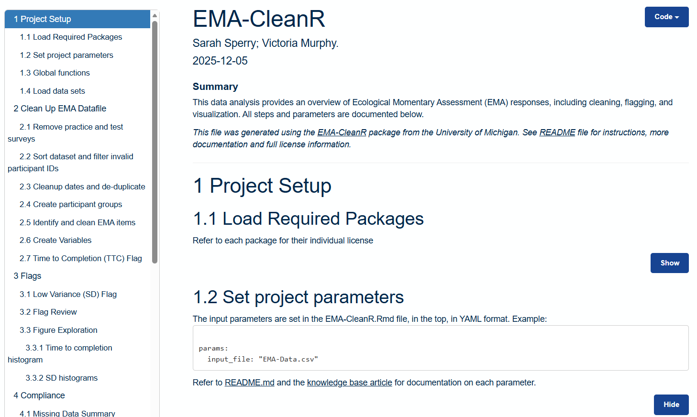
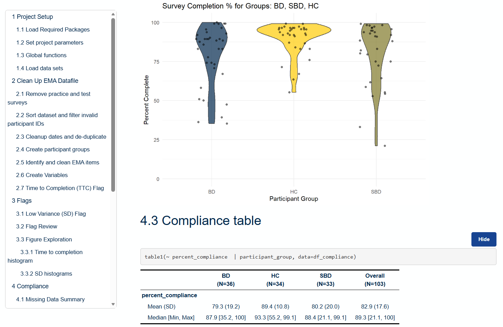

<!--
This file is part of EMA-CleanR
README.md
Author(s): Sarah Sperry; Victoria Murphy.
Created: 2025-12-12
Summary: Provides an overview of the project, in Markdown format.
Notes: See README file for documentation and full license information.

Copyright © 2025 The Regents of the University of Michigan

This program is free software: you can redistribute it and/or modify
it under the terms of the GNU General Public License as published by
the Free Software Foundation, either version 3 of the License, or (at your option) any later version.
This program is distributed in the hope that it will be useful,
but WITHOUT ANY WARRANTY; without even the implied warranty of
MERCHANTABILITY or FITNESS FOR A PARTICULAR PURPOSE. See the
GNU General Public License for more details.
You should have received a copy of the GNU General Public License along
with this program. If not, see <https://www.gnu.org/licenses/>.

-->

# EMA-CleanR

## Description
EMA-CleanR is a program for efficient pre-processing, cleaning, and visualization of Ecological Momentary Assessment (EMA) survey data in R to enable high-quality, real-time behavioral insights. It was created by Dr. Sarah Sperry and Victoria Murphy of the Emotion and Temporal Dynamics (EmoTe) Lab at the University of Michigan.

## Quick Start Guide
+ To view sample data and a code walk-through, simply visit: https://depressioncenter.github.io/EMA-CleanR/EMA-CleanR.html
+ To use with your own data, first download and extract this repository (or clone it).
+ Replace **EMA-Data.csv** with your own file.
  + Ensure it has at least these columns: participantidentifier,surveyname,start_datetime,end_datetime
  + There should be one column per question, and the column headings should start with "EMA_" (e.g. EMA_01, EMA_02, etc.)
  + Each row represents one survey taken by one participant at one point in time.
+ Open **EMA-CleanR.Rmd** with R-Studio. If asked, install any missing packages.
+ Edit the parameters at the top if needed (e.g. input file name), in the YAML section.
+ Click the "Knit" button (or Ctrl+Shift+K) to generate a new **EMA-CleanR.html** file. This will contain a walk-through analysis of your data and visualizations.
+ The output directory will contain exports of the data analysis in CSV format.

## Documentation
+ The full documentation is available at: https://teamdynamix.umich.edu/TDClient/210/DepressionCenter/KB/ArticleDet?ID=14610

## Additional Resources
+ EmoTe Lab projects - https://sperry.lab.medicine.umich.edu/active-projects

## About the Team
The Emotion and Temporal Dynamics (EmoTe) Lab, directed by Dr. Sarah Sperry, in the Department of Psychiatry at the University of Michigan and affiliated with the Heinz C. Prechter Bipolar Research Program, has a broad mission to improve early detection, predict illness trajectory, and develop personalized interventions for bipolar spectrum disorders (BSDs). Within this broader mission we are working to better characterize and understand intraindividual variability in emotion and behavior in real-world contexts. We use digital phenotyping methods (smartphones and wearables) and advanced idiographic statistical methods to model dynamics over both micro (e.g., momentary) and macro (e.g., years) timescales.

Learn more at: [EmoTe Lab](https://sperry.lab.medicine.umich.edu/home)

_The code for this project is maintained in collaboration with the [Eisenberg Family Depression Center](https://depressioncenter.org) [(@DepressionCenter)](https://github.com/DepressionCenter) at the University of Michigan._

## Contact
To get in touch, contact the individual developers in the check-in history.

If you need assistance identifying a contact person, email the project maintainers at: efdc-mobiletech@umich.edu.

## Credits
#### Authors:
+ [Sarah Sperry](https://medschool.umich.edu/profile/7615/sarah-sperry)
+ [Victoria Murphy](https://mcommunity.umich.edu/person/vamurphy) [ (@victoria-murphy) ](https://github.com/victoria-murphy)

#### Contributors:
+ [Sarah Sperry](https://medschool.umich.edu/profile/7615/sarah-sperry)
+ [Victoria Murphy](https://mcommunity.umich.edu/person/vamurphy) [ (@victoria-murphy) ](https://github.com/victoria-murphy)
+ [Gabriel Mongefranco](https://gabriel.mongefranco.com) [(@gabrielmongefranco)](https://github.com/gabrielmongefranco)
+ [Eisenberg Family Depression Center](https://depressioncenter.org) [(@DepressionCenter)](https://github.com/DepressionCenter)

#### This work is based in part on the following projects, libraries and/or studies:
+ [Emotion-based Impulsivity in Bipolar Disorder (EBI-BD)](https://sperry.lab.medicine.umich.edu/active-projects) study
+ [EFDC TDX Knowldge Base Templates](https://github.com/DepressionCenter/EFDC-TDX-KB)
+ R libraries used: dplyr, psych, tidyverse, lubridate, table1, corrplot, ggplot2, patchwork, rlang

## License
### Copyright Notice
Copyright © 2025 The Regents of the University of Michigan

### Software and Library License Notice
This program is free software: you can redistribute it and/or modify it under the terms of the GNU General Public License as published by the Free Software Foundation, either version 3 of the License, or (at your option) any later version.

This program is distributed in the hope that it will be useful, but WITHOUT ANY WARRANTY; without even the implied warranty of MERCHANTABILITY or FITNESS FOR A PARTICULAR PURPOSE. See the GNU General Public License for more details.

You should have received a copy of the GNU General Public License along with this program. If not, see <https://www.gnu.org/licenses/gpl-3.0-standalone.html>.

### Documentation License Notice
Permission is granted to copy, distribute and/or modify this document 
under the terms of the GNU Free Documentation License, Version 1.3 
or any later version published by the Free Software Foundation; 
with no Invariant Sections, no Front-Cover Texts, and no Back-Cover Texts. 
You should have received a copy of the license included in the section entitled "GNU 
Free Documentation License". If not, see <https://www.gnu.org/licenses/fdl-1.3-standalone.html>

## Citation
If you find this repository, code or paper useful for your research, please cite it.

#### Citation Example:
>_Sperry, Sarah; Murphy, Victoria (2025). EMA-CleanR. University of Michigan. Software. https://github.com/DepressionCenter/EMA-CleanR_  
​​​​​​​     _DOI: [10.5281/zenodo.17982075](https://doi.org/10.5281/zenodo.17982075)_

----

Copyright © 2025 The Regents of the University of Michigan
